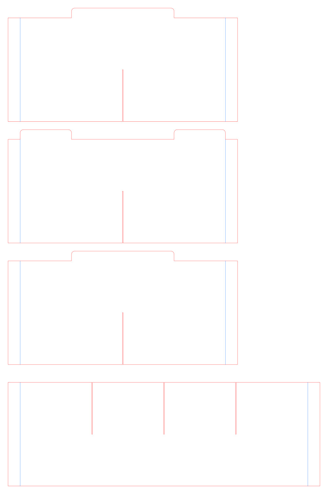
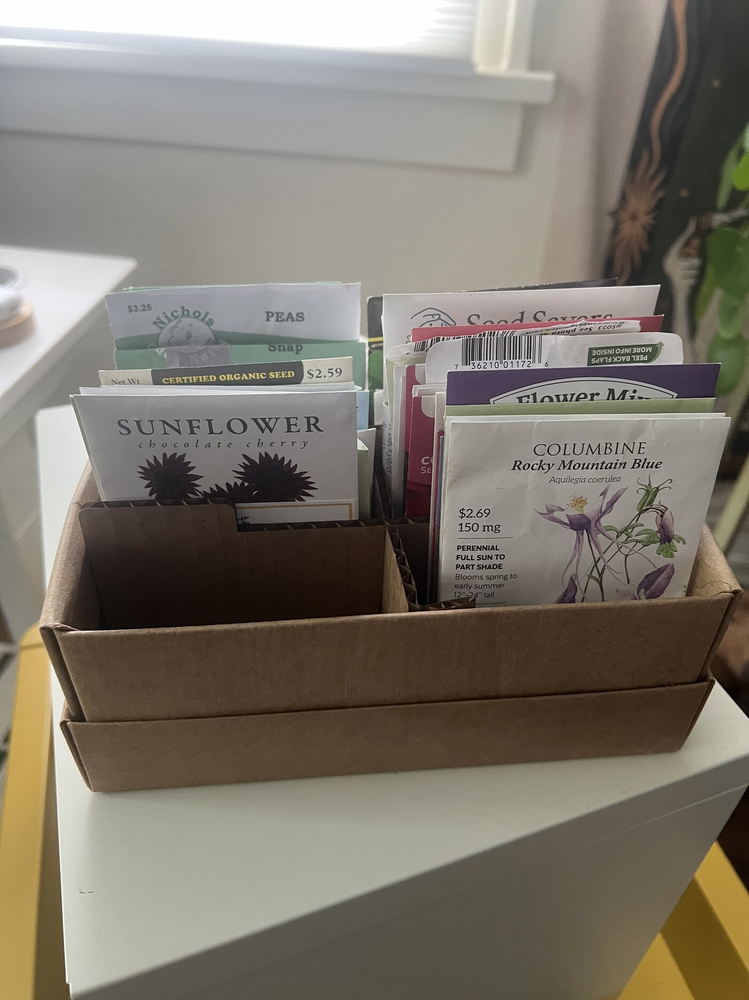

# Shoebox Seed Organizer

Generate SVG laser-cut divider inserts for a shoebox seed organizer.

This project is for folded cardboard or cardstock dividers. It takes the interior
dimensions of a shoebox, the number of compartment rows and columns, and the
material thickness, then writes a flat SVG cut pattern.

The generated pattern includes:

- Interlocking horizontal and vertical divider strips.
- 90-degree fold flaps at the outer ends of each strip for stability.
- Alternating raised tabs with rounded top corners on the horizontal separators.
- One SVG group per divider panel, so panels can be moved around after import.

## Quick Start

From the project root:

```bash
PYTHONPATH=src python -m shoebox_seed_organizer.cli \
  --width-mm 254 \
  --depth-mm 356 \
  --height-mm 128 \
  --rows 4 \
  --cols 2 \
  --material-mm 0.8 \
  --output organizer.svg
```






The photo above shows a cut cardboard organizer in use.

Open `organizer.svg` in your laser cutter software. Each divider panel is a
top-level SVG group containing its own cut and score paths, so you can move
panels around after import. The SVG uses red paths for cuts and blue paths for
fold scores.

## Dimensions

All dimensions are in millimeters.

- `--width-mm`: shoebox interior width, left to right.
- `--depth-mm`: shoebox interior depth, front to back.
- `--height-mm`: divider wall height before raised tabs.
- `--rows`: number of compartments along the depth.
- `--cols`: number of compartments along the width.
- `--material-mm`: cardboard or cardstock thickness.

For the quick-start example, `--rows 4 --cols 2` creates three horizontal
separators and one vertical separator.

## Optional Settings

```bash
--kerf-mm 0.1
--slot-clearance-mm 0
--flap-mm 15
--tab-height-mm 12
--tab-radius-mm 4
```

- `--kerf-mm`: subtracts laser kerf from the slot width. Default: `0.1`.
- `--slot-clearance-mm`: adds fit clearance to the slot width. Default: `0` for a snug cardboard fit.
- `--flap-mm`: length of each fold flap. Default: `15`.
- `--tab-height-mm`: height of the raised tabs. Default: `12`.
- `--tab-radius-mm`: radius for the raised tab top corners. Default: `4`.

The effective slot width is:

```text
material-mm + slot-clearance-mm - kerf-mm
```

## Installable CLI

You can also install the project in editable mode:

```bash
python -m pip install -e .
shoebox-seed-organizer \
  --width-mm 254 \
  --depth-mm 356 \
  --height-mm 128 \
  --rows 8 \
  --cols 2 \
  --material-mm 0.8 \
  --output organizer.svg
```

## Tests

Run the test suite with:

```bash
uv run pytest
```

Run the development checks with:

```bash
uv run ruff check .
uv run ruff format --check .
uv run mypy src
```

Run the configured `prek` hooks with:

```bash
uv run prek validate-config prek.toml
uv run prek run --all-files
```
